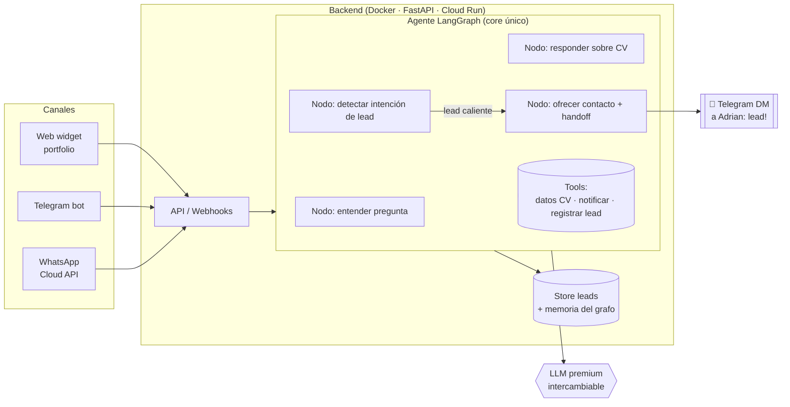

# Arquitectura — Chatbot agéntico multicanal (LangChain + LangGraph)

> Documento de diseño vivo del proyecto **"AI Assistant del portfolio"**.
> Rama de trabajo: `feature/ai-chatbot-langgraph` · Fecha inicial: 2026-09-17 · Autor: Adrian Cajas
>
> Este doc es la fuente de verdad del diseño. Se actualiza a medida que avanzamos.

---

## 1. Objetivo y motivación

Adrian está buscando trabajo (Data Engineer & AI, Madrid). El problema clásico: **los proyectos que ha hecho se quedaron en las empresas** y no se pueden enseñar. La solución de este proyecto es *"show, don't tell"*:

- Construir una **demo pública, real y tocable** que un reclutador pueda probar en el propio portfolio.
- Que esa demo **sea** la prueba de habilidad: un agente conversacional montado con **LangChain + LangGraph** (agéntica), con canales de **WhatsApp** y **Telegram**, y **alertas de leads** al móvil de Adrian.
- Ganar experiencia real y demostrable en **LangGraph** para poder ponerlo en el CV con un proyecto detrás.
- Como efecto secundario: sirve de **engagement / captación de leads** (si a un reclutador le interesa, el bot le ofrece contacto directo y avisa a Adrian).

### Objetivos (goals)
- Agente que responde preguntas sobre la experiencia/CV de Adrian, **fiel a la realidad** (sin inventar).
- Un **único cerebro** (grafo LangGraph) reutilizado en 3 canales: web, Telegram, WhatsApp.
- **Detección de intención**: cuando alguien muestra interés real, el bot ofrece contacto y **avisa a Adrian al móvil**.
- **Coste controlado** (cerca de €0 en reposo, con topes de gasto duros).
- Todo **documentado y en git**, desplegable y reproducible.

### No-objetivos (por ahora)
- No es un CRM completo ni un producto SaaS.
- No sustituye a Adrian: en cuanto hay un lead caliente, se hace **handoff a humano**.
- No usamos vector DB / RAG al inicio (el CV cabe en contexto — ver Decisión D5).

---

## 2. Decisiones de diseño (ADR resumido)

| # | Decisión | Motivo |
|---|----------|--------|
| **D1** | **Backend separado en contenedor** (no dentro del sitio estático) | Las API keys del LLM van en servidor; LangChain/LangGraph es Python. El frontend sigue estático en Firebase (gratis). |
| **D2** | **Un cerebro, muchos canales**: agente LangGraph único + adaptadores finos por canal | Evita triplicar lógica; demuestra criterio de arquitectura. |
| **D3** | **Backend cloud-portable** (Docker + FastAPI), LLM detrás de interfaz intercambiable | La nube pasa a ser un detalle de despliegue. Permite desplegar en GCP **y** Azure (2 líneas de CV). |
| **D4** | **Desplegar primero en GCP Cloud Run** (escala a cero) | La web ya está en Google/Firebase → menos fricción, un solo ecosistema, casi €0. Azure queda como fase opcional posterior. |
| **D5** | **Sin RAG/vector DB al inicio**: CV completo en el prompt del sistema | El CV es pequeño; meter Pinecone/Chroma sería sobre-ingeniería. Se añade vector store solo si el contenido crece. |
| **D6** | **LLM premium pero intercambiable**, modelo eficiente por defecto | Calidad de respuesta (representa a Adrian profesionalmente) sin factura sorpresa: p. ej. **Claude Haiku 4.5** por defecto, escalar a **Sonnet/Opus** o GPT solo en nodos que lo requieran. |
| **D7** | **Telegram = canal público + transporte de alertas** al móvil de Adrian | Gratis, instantáneo, 5 min de setup. No hace falta montar notificaciones aparte. |
| **D8** | **WhatsApp vía Business Platform / Cloud API oficial** (número dedicado) | La vía no oficial (Baileys, whatsapp-web.js) sobre el número personal tiene **riesgo de baneo**. Se hace bien desde el principio. |
| **D9** | **Orden de construcción fácil→difícil**: Web → Telegram → WhatsApp | Cada canal reutiliza el core; WhatsApp es el de más fricción (verificación de negocio) y va al final. |
| **D10** | **Handoff a humano** cuando hay lead caliente | LangGraph soporta interrupts/human-in-the-loop → aprendizaje + buena UX + línea de CV. |

---

## 3. Arquitectura

**Idea central: un cerebro, muchos canales.** El agente LangGraph se define una vez; cada canal es un adaptador delgado que traduce su formato al del core y de vuelta.



### Flujo de un lead caliente
1. Alguien pregunta algo específico (disponibilidad, encaje con una vacante, "¿cómo contacto?", tecnología concreta…).
2. El **nodo de detección de intención** lo clasifica como *lead caliente*.
3. El bot **ofrece** al usuario seguir por WhatsApp/Telegram o dejar contacto.
4. Un **tool** registra el lead y **te avisa por Telegram al móvil**: *"👀 Alguien pregunta por X en el canal Web"*.
5. Opcional: **handoff** — Adrian entra en la conversación (interrupt del grafo).

---

## 4. Stack tecnológico

| Capa | Elección | Nota |
|------|----------|------|
| Frontend widget | Vanilla JS (coherente con el sitio actual) + streaming SSE | Sin frameworks; encaja con `index.html`/`app.js`. |
| Backend | **Python + FastAPI** (async) | Webhooks + API de chat. |
| Orquestación | **LangChain + LangGraph** | El core del proyecto. Grafo con nodos, tools, memoria y human-in-the-loop. |
| LLM | Premium **intercambiable** (default: Claude Haiku 4.5) | Detrás de una interfaz; se cambia por env var. |
| Memoria/estado | Checkpointer de LangGraph (memoria → Postgres/Firestore si hace falta persistir) | Empezamos simple. |
| Canales | Web (REST/SSE) · Telegram Bot API · WhatsApp Cloud API | Adaptadores por canal. |
| Observabilidad | **LangSmith** (capa gratis) | Trazas del agente para debug + aprendizaje. |
| Contenedor | **Docker** | Portabilidad entre nubes. |
| Deploy | **GCP Cloud Run** (fase 1) · Azure Container Apps (opcional) | Escala a cero. |
| Secretos | Secret Manager (GCP) / Key Vault (Azure) | Nunca en el repo ni en el frontend. |
| Store de leads | Firestore o SQLite/Postgres | Ligero; para follow-up + métricas. |

---

## 5. Estructura de repositorio (propuesta)

```
adrian-portfolio/
├── index.html · app.js · styles.css   # frontend actual (se mantiene en Firebase)
├── assets/chat-widget/                 # NUEVO widget de chat (JS/CSS) que se sirve estático
├── backend/                            # NUEVO servicio del agente
│   ├── app/
│   │   ├── main.py                     # FastAPI: rutas /chat, /webhook/telegram, /webhook/whatsapp
│   │   ├── agent/                      # grafo LangGraph: graph.py, nodes.py, tools.py, prompts/
│   │   ├── channels/                   # adaptadores: web.py, telegram.py, whatsapp.py
│   │   ├── core/                       # config, provider LLM, secretos, rate-limit
│   │   └── data/                       # contenido del CV (grounding) + store de leads
│   ├── Dockerfile
│   ├── pyproject.toml / requirements.txt
│   └── .env.example                    # plantilla de variables (sin secretos reales)
├── docs/
│   └── ARCHITECTURE.md                 # este documento
└── .github/workflows/
    ├── firebase-deploy.yml             # existente (solo frontend, push a master)
    └── backend-deploy.yml              # NUEVO (deploy del backend a Cloud Run)
```

> **Importante:** el backend **no** se despliega con el workflow de Firebase. Frontend → Firebase Hosting; backend → Cloud Run (workflow aparte). Separación limpia.

---

## 6. Roadmap por fases (fácil → difícil)

### Fase 0 — Preparación ✅ (en curso)
- [x] Rama `feature/ai-chatbot-langgraph` creada (aislada de `master`).
- [x] Este documento de diseño.
- [ ] Commit + push de la rama.

### Fase 1 — Backend mínimo + widget web (lo más fácil)
- Esqueleto FastAPI + Dockerfile.
- Agente **LangChain** básico que responde sobre el CV (CV en el prompt del sistema).
- Widget de chat en el portfolio (burbuja flotante) con streaming.
- Deploy a Cloud Run. CORS bloqueado al dominio del portfolio.
- **Guardarraíles de coste** desde el día 1 (ver §7).
- **Entregable:** chatbot en vivo en la web respondiendo sobre Adrian.

### Fase 2 — Convertir a LangGraph "de verdad" (medio)
- Migrar de cadena simple a **grafo LangGraph**: nodos, aristas condicionales, memoria.
- **Nodo de detección de intención** de lead.
- **Tool de alerta**: avisar a Adrian por Telegram cuando hay lead caliente.
- Registro de leads en el store.
- **Entregable:** el bot detecta interés y te avisa al móvil.

### Fase 3 — Canal Telegram (medio)
- Bot de Telegram (BotFather) conectado al mismo core vía webhook.
- Reutiliza el grafo; solo cambia el adaptador.
- **Entregable:** hablar con el mismo agente por Telegram.

### Fase 4 — Canal WhatsApp Business (lo más difícil) — ver §8
- Onboarding de **WhatsApp Business Platform (Cloud API)** con número dedicado.
- Webhook + plantillas + ventana de 24h.
- **Entregable:** el agente también responde por WhatsApp, oficial y sin riesgo de baneo.

### Fase 5 — Pulido, métricas y (opcional) Azure
- Panel/analítica: nº de conversaciones, intención, conversión a lead.
- Handoff a humano refinado.
- **Opcional:** replicar deploy en **Azure Container Apps** → segunda línea de CV.
- Actualizar `master`, LinkedIn y CV con el proyecto.

---

## 7. Modelo de coste y guardarraíles (crítico buscando trabajo)

**Objetivo: cerca de €0 en reposo, sin factura sorpresa.**

- **Cloud Run escala a cero** → no pagas cómputo si nadie usa el bot.
- **Coste real = tokens del LLM.** Con modelo eficiente por defecto y poco tráfico, céntimos/mes.
- Guardarraíles obligatorios desde Fase 1:
  - **Rate-limit** por sesión/IP.
  - **Límite de tokens** por mensaje y de longitud de entrada.
  - **Tope de gasto mensual** con alerta de billing (GCP Budget + alerta al email).
  - Modelo **barato por defecto**, escalar solo en nodos que lo pidan.
  - **System prompt con guardarraíles**: on-topic (CV/experiencia de Adrian), rechaza abuso/off-topic, **no inventa experiencia** (coherencia con LinkedIn/CV).

---

## 8. WhatsApp Business — onboarding (tarea dedicada) 📌

> Objetivo: hacerlo **bien y oficial** desde el principio. Usamos **WhatsApp Business Platform (Cloud API)** de Meta, no librerías no oficiales.

### Conceptos clave (leer antes de empezar)
- Existen dos cosas distintas: la **app WhatsApp Business** (manual, para pymes) y la **Cloud API / Business Platform** (programable, para bots). **Nosotros usamos la Cloud API.**
- ⚠️ **Un número solo puede estar en un sitio a la vez.** Si registras un número en la Cloud API, deja de funcionar en el WhatsApp normal. → **Usar un número dedicado** (segunda SIM o número virtual), **no** el personal de Adrian.
- Hay una **ventana de servicio de 24h**: fuera de ella, para escribir proactivamente hacen falta **plantillas aprobadas** por Meta.
- La **verificación de negocio** de Meta puede tardar → **empezar pronto** (es el cuello de botella).

### Checklist — 🧑 = lo hace Adrian (cuentas/verificación) · 🤝 = lo montamos juntos (código)
- [ ] 🧑 Crear **cuenta de Meta Business** (business.facebook.com).
- [ ] 🧑 Crear app en **Meta for Developers** (developers.facebook.com) y añadir el producto **WhatsApp**.
- [ ] 🤝 Usar el **número de test gratuito** que da Meta para desarrollar el bot antes de ir a producción.
- [ ] 🧑 Conseguir un **número dedicado** para el bot (segunda SIM / número virtual) que **no** esté en WhatsApp.
- [ ] 🧑 Añadir y **verificar** ese número en la Cloud API.
- [ ] 🧑 Lanzar la **verificación de negocio** de Meta (empezar pronto).
- [ ] 🤝 Generar un **token permanente** (system user), no el temporal de 24h.
- [ ] 🤝 Configurar el **webhook** apuntando al backend (`/webhook/whatsapp`) con su verify token.
- [ ] 🤝 Manejar la **ventana de 24h** y crear/enviar **plantillas** para mensajes proactivos.
- [ ] 🤝 Conectar el webhook al **mismo core LangGraph** (adaptador `whatsapp.py`).

### Atajo para practicar antes de la verificación
Mientras llega la verificación de negocio, se puede usar el **sandbox de WhatsApp de Twilio** para probar el flujo end-to-end en minutos, y luego migrar a la **Cloud API directa de Meta** para producción (más barato, sin markup de Twilio).

> **Nota de permisos:** crear cuentas, verificar el negocio y aceptar términos **los hace Adrian** (yo no creo cuentas ni acepto términos por ti). Te guío paso a paso en cada uno cuando lleguemos a la Fase 4.

---

## 9. Seguridad y privacidad
- **Secretos** (API keys, tokens) solo en Secret Manager/Key Vault. Nunca en el repo ni en el frontend.
- **CORS** del backend limitado al dominio del portfolio.
- **Rate-limit + validación de entrada** contra abuso.
- **GDPR** (Adrian está en la UE): si se capturan datos de contacto de leads, aviso claro + minimizar datos + no guardar más de lo necesario. Mantenerlo ligero.
- **No exponer** información personal sensible del CV que no esté ya pública en el portfolio.

---

## 10. Riesgos y mitigaciones

| Riesgo | Mitigación |
|--------|-----------|
| Factura sorpresa del LLM (bot público) | Rate-limit + topes de gasto + modelo barato por defecto (§7). |
| Baneo del número de WhatsApp | Cloud API oficial + número dedicado (§8). |
| El bot **inventa** experiencia (rompe coherencia con LinkedIn/CV) | Grounding estricto en el CV + system prompt que prohíbe inventar. |
| Verificación de negocio de Meta lenta | Empezar el trámite pronto; usar test number / Twilio sandbox mientras. |
| Spam/abuso del canal público | Rate-limit, filtros de contenido, on-topic guardrails. |

---

## 11. Puntos para el CV / narrativa de entrevista
Al terminar, Adrian podrá decir (con demo en vivo detrás):
- *"Diseñé y desplegué un **agente conversacional con LangGraph** (nodos, aristas condicionales, memoria, human-in-the-loop)."*
- *"Arquitectura **un core, multicanal**: web, **Telegram** y **WhatsApp Business Platform (Cloud API)**."*
- *"**Detección de intención** de leads con alerta en tiempo real y handoff a humano."*
- *"Backend **cloud-portable** (Docker + FastAPI) en **GCP Cloud Run** (escala a cero), instrumentado con **LangSmith**."*
- *"Control de coste con rate-limiting y topes de gasto; secretos gestionados."*

---

## 12. Estado actual
- ✅ Rama de trabajo creada y `master` intacto.
- ✅ Documento de diseño (este archivo).
- ⏭️ Siguiente: **Fase 1** — esqueleto del backend + agente básico + widget web.

> Decisiones abiertas / a revisar más adelante: proveedor LLM concreto por nodo, store definitivo de leads, si añadimos Azure en Fase 5.
